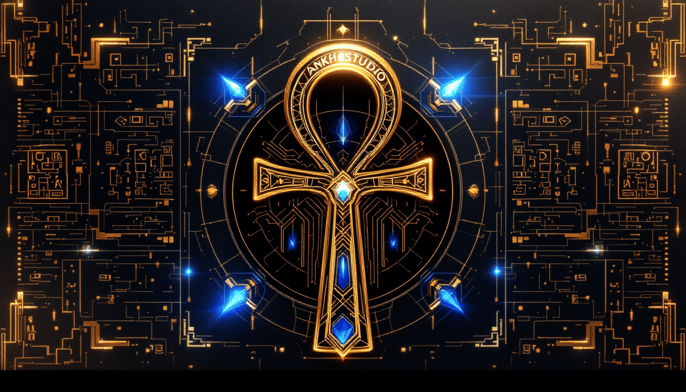

  
# ⟨ANKH STUDIO⟩
### *Breathing Life Into Software*

*Ancient wisdom. Modern innovation. Timeless software.*

---

## 𓂀 Vision

We are digital architects of the new age, forging technology that bridges millennia. Each program we craft contains both ancient wisdom and future innovation – built not merely to function, but to endure.

## 𓆣 Principles

| Symbol | Principle | Meaning |
|:------:|-----------|---------|
| 𓂋 | **Authority** | Technical excellence as our foundation |
| 𓇯 | **Balance** | Harmony between function and form |
| 𓃭 | **Protection** | Code that shields and preserves |
| 𓆭 | **Wisdom** | Learning across time and technology |

## 𓇳 Core Technologies

### 𓎟 Frontend

  
  
  
  
  

### 𓃀 Backend

  
  
  
  
  

### 𓁢 Database & Cloud

  
  
  
  
  

### 𓄿 Machine Learning & AI

  
  
  
  
  

### 𓋴 DevOps & Tools

  
  
  
  
  

### 𓂧 Emerging Technologies

  
  
  
  
  

## 𓏲 Connect

---

Crafted with eternal purpose using the breath of digital life | Est. MMXXIII

